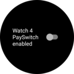
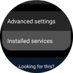
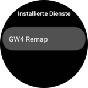
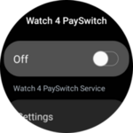
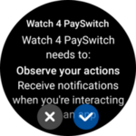
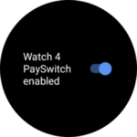
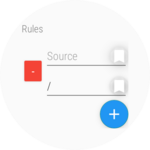
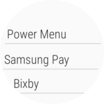

# GW4 Remap

GW4 Remap allows you remap the hardware buttons on the Galaxy Watch 4 and Galaxy Watch 5.

## Installation

TBD
<!--  -->

## Usage

| First launch setup   |                                                             |
| -------------------- | ----------------------------------------------------------- |
|  | Press the switch to start the setup                         |
|  | Select `Installed services`                                 |
|  | Select `GW4 Remap`                                          |
|  | Enable the Service                                          |
|  | Confirm                                                     |
|  | Go back to the app and your should see the rules screen     |

| Creating rules        |                                                                     |
| --------------------- | ------------------------------------------------------------------- |
|   | Press the `+` button to create a new rule                           |
|   | Press the bookmark icon next to the source input to select a source |
|   | Select the source                                                   |
|  | Do the same for the target                                          |

That's it. Your buttons should now be remapped.

## License
[Apache License 2.0](https://choosealicense.com/licenses/apache-2.0/)
